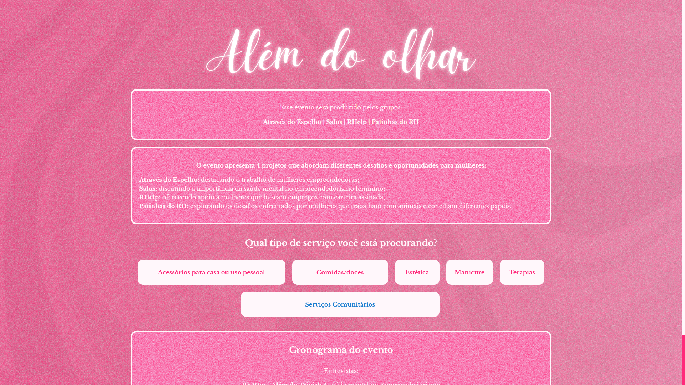

# Além do Olhar

> Official platform of the "Além do Olhar" project.
>
> Site: [Além do Olhar](https://alem-do-olhar.vercel.app)

### Adjustments and improvements

The project is still under development and the next updates will focus on the following tasks:

- [ ] Improve image loading
- [ ] Make the site responsive for tablets
- [ ] Make CSS cleaner